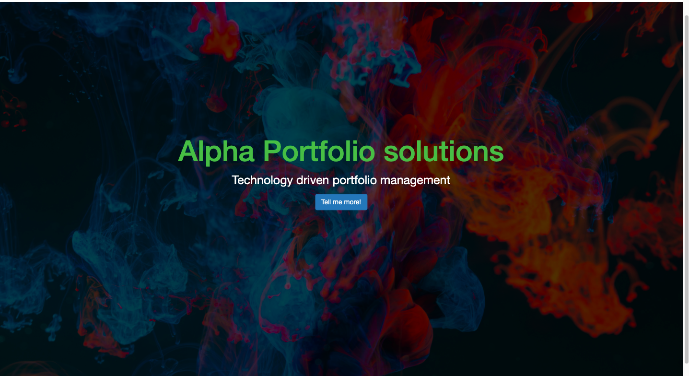
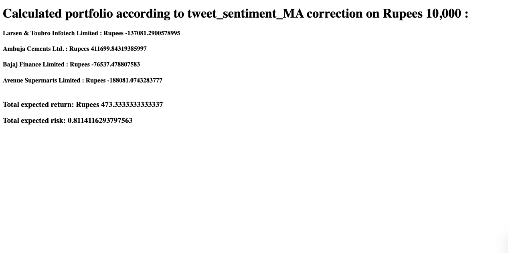

# We provide technology driven portfolio optimization solutions

## Approach :
#### The user is given the option of selecting assets from BSE he wants to invest in
#### We scrape market relevant tweets and perform sentiment analysis on them to estimate the market state(bullish or bearish)
#### We have used a hybrid portfolio optimization technique: Sentiment + Conventional modern portfolio theory
#### The optimum portfolio optained from the proposed hybrid portfolio optimization technique is then presented to the user 

